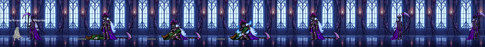
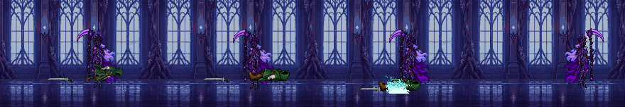
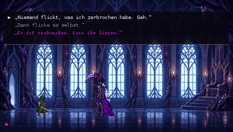
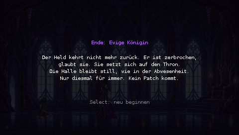
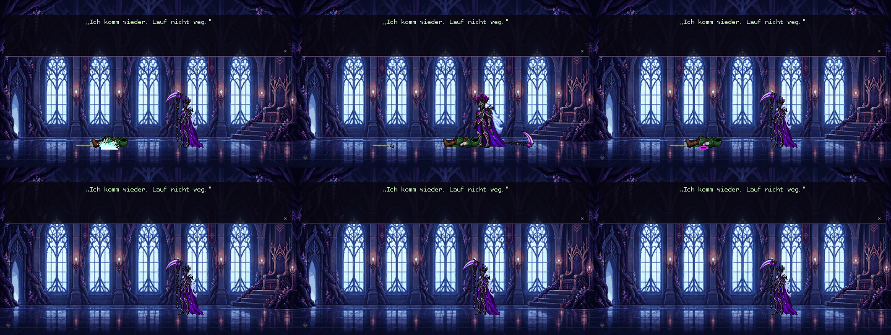
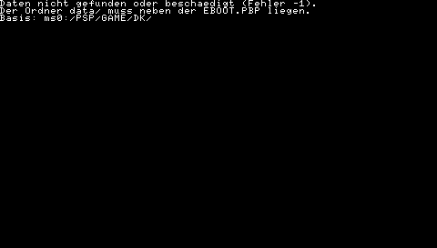

# PSP-1000: Testszene

Erste spielbare Testszene in C mit dem PSPSDK (pspdev), 60 Bilder pro Sekunde.

## Starten

- **PPSSPP (PC):** `EBOOT.PBP` öffnen. Der Ordner `data/` muss daneben liegen.
- **PSP-1000 mit Custom Firmware:** den Ordner so auf den Memory Stick kopieren:
  ```
  ms0:/PSP/GAME/DunkleKoenigin/EBOOT.PBP
  ms0:/PSP/GAME/DunkleKoenigin/data/*.bin
  ```

## Steuerung

| Taste | Phase 1 | Phase 2 | Phase 3 |
| --- | --- | --- | --- |
| □ | Richtschlag | Sternschauer | Wurzelranken |
| △ | Sensenzug | Windklinge | Erinnerungsriss |
| ○ | Kreisschnitt | Todesurteil | – |
| L + R | – | – | Weltgericht (einmal je Versuch, nach 20 Sekunden; tötet immer, nur das Zögern in G8 rettet den Helden) |

| Taste | Außerhalb des Kampfes |
| --- | --- |
| ← → / Analog-Stick | Königin gehen |
| ✕ | Gespräch weiter, Antwort bestätigen; beim Körper: Verbrennen |
| ↑ ↓ | Antwort wählen |
| ○ | beim Körper: Umarmen (nach G2, solange das Vertrauen nicht negativ ist) |
| □ | beim Körper: Opfern durch das lila Portal (nach G5) |
| Select | Neustart |
| Home | Beenden |

## Inhalt der Testszene

- Thronsaal in drei Fassungen (Phase 3 noch als dunkler Platzhalter), drei gestapelte Lebensleisten (rot, orange, lila), nur im aktiven Kampf sichtbar.
- **Drei Phasen** mit je eigenen Angriffen und Effekten nach `docs/ANGRIFFE.md`; Flächenangriffe markieren zuerst den Boden. Bis die eigenen Phase-3-Bilder vorliegen, nutzt Phase 3 die Phase-2-Figur mit lila Tönung.
- **Impuls 1** (rot → orange): Ringwelle, der Held lernt darüberzuspringen. **Impuls 2** (orange → lila): lila Nebel flutet den Saal; nur das Amulett hält mit seinem goldenen Schild eine Lücke um den Helden frei.
- Held mit Lern-KI: ohne Erfahrung keine Reaktion, nach ein bis zwei Treffern die falsche Ausweichart, ab dem dritten die richtige (Rolle oder Sprung).
- **Ausrüstung über Quests**: Umhang (5. Tod), zweiter Umhang (11. Tod), Amulett (nach dem ersten Tod im Nebel), goldenes Schwert (nach drei Toden in Phase 3). Jede Stufe bringt ein Herz mehr und eine neue Umhangfarbe.
- **Gespräche mit Auswahl** G1–G8 und R2–R4 aus `docs/DIALOGE.md`: zwei bis drei Antworten, die erste ist immer die Rolle des Endbosses. Die Antworten verändern Vertrauen, Einfluss der Verderbnis und Guide-Wissen. Zeilen der Verderbnis erscheinen magenta in einer eigenen Schrift. Im Kampf wird nicht gesprochen, nur Verwandlungen und das Zögern beim Weltgericht (G8) unterbrechen ihn.
- **Totenritual**: Stille, die Königin geht zum Körper; ✕ Verbrennen, ○ Umarmen, □ Opfern. Der Held kehrt zurück, sobald sie wieder rechts im Saal steht; die Rückkehrworte spricht vor allem die Königin.
- Tod: Der Held sackt nach vorn zur Königin hin zusammen, das Schwert bleibt neben ihm liegen; der Körper behält seine Lage, auch wenn sie vorbeigeht.
- Richtschlag, Schwerthieb des Helden und die Umarmung (sie geht selbst an seinen Kopf, legt die Sense ab, kniet, hält ihn, eisblaues Feuer in ihren Armen, steht auf) stammen aus den bewegten Entwürfen in `assets/animationen/`. Die gezeichnete Umarmung gibt es bisher nur in Phase 1; in Phase 2 und 3 hebt sie ihn an, er liegt vor ihr mit dem Kopf an ihrer Brust und verbrennt in ihren Armen. Rituale sind erst möglich, wenn er liegt.
- **Enden E1–E6** je nach Entscheidungen und Werten, mit Abschlussbild; Select beginnt neu.

**Noch nicht enthalten:** Gehen-Animationen (Figuren gleiten), eigene Phase-3-Grafik, das verborgene Ende, Musik und Ton.

## Getestet

Im Emulator PPSSPP (ohne Oberfläche) mit einer Demo-Variante, in der ein Skript die Königin steuert (`-DDEMO=<Schritte>`, siehe `src/main.c`; im Demo-Lauf sind die Leisten kürzer). Zehn Minuten Spielzeit: 20 Tode des Helden, alle drei Rituale, drei Quests bis zum Amulett, die Gespräche G1–G8 sowie R2 und R3, beide Impulse, Phase 3 mit dem Zögern beim Weltgericht (G8) und das Ende „Befreiung“ laufen ohne Absturz durch. Bildschirmfotos aus dem Emulator:


**Totenritual nach dem Merge (Stand c00fb67)** im Emulator PPSSPPHeadless (aus dem Quellcode gebaut, `-DHEADLESS=ON -DHEADLESS_CROSS=ON`) mit drei Demo-Läufen von je elf Minuten. In einer Testkopie, die nicht im Repository liegt, fotografiert die Demo während jeder Umarmung alle zehn Bilder und schreibt den Ritual-Zustand mit. Zwei Varianten erzwingen zusätzlich, dass der Held rechts von der Königin stirbt bzw. jeder Versuch in Phase 3 beginnt.

- Phase 1: acht Umarmungen, vier davon gespiegelt (Held rechts von ihr). Jedes Mal geht sie selbst an seinen Kopf, kniet am Kniepunkt (43 Ticks Umarmung), steht ohne Sense auf (8 Ticks) und nimmt sie danach wieder; das Schwert liegt bis zum Zerfall daneben. Auch ein Körper bei x = 56 am linken Saalrand ist erreichbar.
- Phase 2 und 3: ohne Gehen und Knien. Sie hebt ihn über 20 Ticks an, er liegt vor ihr mit dem Kopf an ihrer Brust und verbrennt in ihren Armen; das Schwert bleibt am Boden. Vorher ragte der neue, längere Körper dabei hinter ihr heraus und fiel zum Verbrennen an seine alte Stelle zurück. Auch gespiegelt geprüft.
- Rituale starten erst, wenn der Held liegt (Tod-Bild 7). Vorher konnte ○ mitten im Fallen gedrückt werden; dann wurde er im Fallen angehoben bzw. in Phase 1 abrupt durch die liegende Pose ersetzt.
- Alle drei Läufe enden ohne Absturz mit einem Ende.




**Helden-KI und „Der Patch“ (Stand 1bfa37c, PRX-Build)** im Emulator PPSSPPHeadless, drei Demo-Läufe mit je einer festen Antwort auf „Der Patch“ (Testkopie mit Protokoll, nicht im Repository):

- `DATA.PSP` im EBOOT ist ein PRX (ELF-Typ 0xFFA0, Ladeadresse 0, mit Relokationen). Das vorige EBOOT war ein Programm mit fester Adresse (ELF-Typ 2, 0x08804000).
- Erholungslücke: Nach jedem Angriff steht die Königin still. Bei einem Angriff, den er noch nicht beherrscht, genau 40 Schritte, ohne Gegenschlag. Bei einem beherrschten Angriff schlug er in allen 12 Fällen zu und traf; die Lücke endete erst nach seinem Hieb (40 bis 104 Schritte, nie bis zur Grenze von 150).
- Eine Verwandlung beendet die Erholung. Vorher lief sie nach der Verwandlung weiter, wenn sein Gegenschlag die Leiste geleert hatte, und die Königin stand danach bis zu 40 Schritte still. Geprüft an 13 Verwandlungen mit laufender Erholung: Danach war sie jedes Mal beendet, und die Königin griff sofort wieder an.
- Durchbruch: Der Schaden seines Hiebs steigt mit den Versuchen ohne neue Phase von 4 über 6, 8 und 10 auf 12 und fällt mit einer neuen Phase wieder auf 4.
- „Der Patch“ kommt genau einmal, zu Beginn des Durchbruchs. „Niemand flickt, was ich zerbrochen habe. Geh.“ führt sofort zu E1 „Ewige Königin“. Die beiden anderen Antworten setzen den Kampf fort (die Verderbnis-Antwort erhöht den Einfluss um 1); diese Läufe enden später mit E5 bzw. E3.




**Korrekturen aus der Code-Prüfung (Stand cfb60f7)** im Emulator PPSSPPHeadless (Testkopie mit festen Szenarien und Protokoll, nicht im Repository):

- Rechter Rand: Die Königin steht bei x 380, der Held rechts von ihr und beherrscht Kreisschnitt und Wurzelranken (je 3 Treffer). Je 20 Angriffe, einmal dort, wo er von selbst steht (x 418–420), einmal direkt an der Wand (x 440). Mit den neuen Ausweichzeitpunkten (Kreisschnitt 16, Ranken 45) wird er in keinem Fall getroffen. Gegenprobe mit den alten Werten (6 und 20): An der Wand trafen beide Angriffe 20 von 20 Mal, der Kreisschnitt auch bei x 418.
- G3 nach dem 5. Tod: Mit allen drei Ritualen (Feuer, Umarmung, Portal) wird während G3 nichts mehr vom Ritual gezeichnet. Gegenprobe mit dem vorigen Stand: Dort erschienen Körper, Schwert, Feuer, Portal bzw. Umarmungspose erneut (obere Reihe). Danach Abwesenheit, Rückkehr und G4 wie vorgesehen.
- Abgeschnittene `data/held.bin` (0, 6, 2000, 5130 und 60000 Byte, also im Kopf, in den Farbtabellen, im Seitenkopf und in den Bildpunkten): Jedes Mal erscheint die Fehlermeldung, kein Absturz. Die Meldung zeigt dabei immer „Fehler -1“, weil `grafik_start` jeden Fehler beim Laden einer Sprite-Gruppe so meldet.




Auf einer echten PSP-1000 ist die Szene noch nicht getestet.

## Bauen

```
python tools/psp/assets_bauen.py      # data/*.bin und src/assets_gen.h aus den Sprites
cd psp
make PSPSDK=C:/pspsdk/psp/sdk "CC=psp-gcc -std=gnu99" EBOOT.PBP   # C:/pspsdk/bin im PATH
```

Gebaut wird mit dem PSPSDK in `C:\pspsdk` (gcc 4.3.5), mit dem auch Ludus Lanista auf der PSP-1000 läuft. Das Makefile baut ein verschiebbares Programm (`BUILD_PRX = 1`), ohne `PSP_FW_VERSION`, und `main.c` fordert einen festen Heap von 12 MB an. Mit `PSP_HEAP_SIZE_KB(-1024)` und `PSP_FW_VERSION = 500` brach der Start auf der PSP-1000 mit 80010002 ab (10.10.2026). `CFLAGS` nicht auf der Kommandozeile überschreiben, sonst fehlen die Include-Pfade des SDK.

## Datenformat

`data/*.bin`: Texturseiten mit 8 Bit pro Pixel (höchstens 512 × 512) und Farbtabellen (CLUT); Aufbau siehe `tools/psp/assets_bauen.py`. Die Helden-Datei enthält fünf Farbtabellen für die Ausrüstungsstufen.
