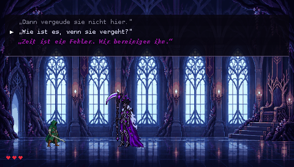
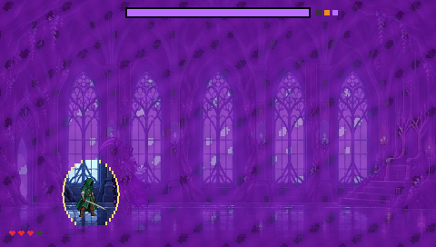
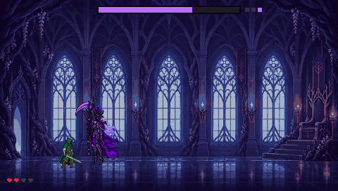
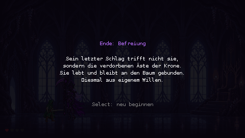
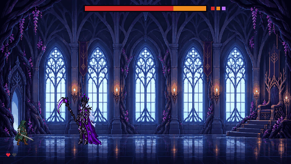
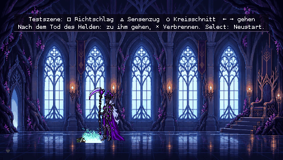
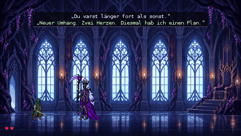

# PSP-1000: Testszene

Erste spielbare Testszene in C mit dem PSPSDK (pspdev), 60 Bilder pro Sekunde.

## Starten

- **PPSSPP (PC):** `EBOOT.PBP` öffnen. Der Ordner `data/` muss daneben liegen.
- **PSP-1000 mit Custom Firmware:** den Ordner so auf den Memory Stick kopieren:
  ```
  ms0:/PSP/GAME/DunkleKoenigin/EBOOT.PBP
  ms0:/PSP/GAME/DunkleKoenigin/data/*.bin
  ```

## Steuerung

| Taste | Phase 1 | Phase 2 | Phase 3 |
| --- | --- | --- | --- |
| □ | Richtschlag | Sternschauer | Wurzelranken |
| △ | Sensenzug | Windklinge | Erinnerungsriss |
| ○ | Kreisschnitt | Todesurteil | – |
| L + R | – | – | Weltgericht (einmal je Versuch, nach 20 Sekunden; tötet immer, nur das Zögern in G8 rettet den Helden) |

| Taste | Außerhalb des Kampfes |
| --- | --- |
| ← → / Analog-Stick | Königin gehen |
| ✕ | Gespräch weiter, Antwort bestätigen; beim Körper: Verbrennen |
| ↑ ↓ | Antwort wählen |
| ○ | beim Körper: Umarmen (nach G2, solange das Vertrauen nicht negativ ist) |
| □ | beim Körper: Opfern durch das lila Portal (nach G5) |
| Select | Neustart |
| Home | Beenden |

## Inhalt der Testszene

- Thronsaal in drei Fassungen (Phase 3 noch als dunkler Platzhalter), drei gestapelte Lebensleisten (rot, orange, lila), nur im aktiven Kampf sichtbar.
- **Drei Phasen** mit je eigenen Angriffen und Effekten nach `docs/ANGRIFFE.md`; Flächenangriffe markieren zuerst den Boden. Bis die eigenen Phase-3-Bilder vorliegen, nutzt Phase 3 die Phase-2-Figur mit lila Tönung.
- **Impuls 1** (rot → orange): Ringwelle, der Held lernt darüberzuspringen. **Impuls 2** (orange → lila): lila Nebel flutet den Saal; nur das Amulett hält mit seinem goldenen Schild eine Lücke um den Helden frei.
- Held mit Lern-KI: ohne Erfahrung keine Reaktion, nach ein bis zwei Treffern die falsche Ausweichart, ab dem dritten die richtige (Rolle oder Sprung).
- **Ausrüstung über Quests**: Umhang (5. Tod), zweiter Umhang (11. Tod), Amulett (nach dem ersten Tod im Nebel), goldenes Schwert (nach drei Toden in Phase 3). Jede Stufe bringt ein Herz mehr und eine neue Umhangfarbe.
- **Gespräche mit Auswahl** G1–G8 und R2–R4 aus `docs/DIALOGE.md`: zwei bis drei Antworten, die erste ist immer die Rolle des Endbosses. Die Antworten verändern Vertrauen, Einfluss der Verderbnis und Guide-Wissen. Zeilen der Verderbnis erscheinen magenta in einer eigenen Schrift. Im Kampf wird nicht gesprochen, nur Verwandlungen und das Zögern beim Weltgericht (G8) unterbrechen ihn.
- **Totenritual**: Stille, die Königin geht zum Körper; ✕ Verbrennen, ○ Umarmen, □ Opfern. Der Held kehrt zurück, sobald sie wieder rechts im Saal steht; die Rückkehrworte spricht vor allem die Königin.
- Richtschlag, Schwerthieb des Helden und die Umarmung (sie kniet, hält ihn, eisblaues Feuer in ihren Armen) stammen aus den bewegten Entwürfen in `assets/animationen/`. Die gezeichnete Umarmung gibt es bisher nur in Phase 1; stirbt der Held in Phase 2 oder 3, hält sie ihn wie zuvor.
- **Enden E1–E6** je nach Entscheidungen und Werten, mit Abschlussbild; Select beginnt neu.

**Noch nicht enthalten:** Gehen-Animationen (Figuren gleiten), eigene Phase-3-Grafik, das verborgene Ende, Musik und Ton.

## Getestet

Im Emulator PPSSPP (ohne Oberfläche) mit einer Demo-Variante, in der ein Skript die Königin steuert (`-DDEMO=<Schritte>`, siehe `src/main.c`; im Demo-Lauf sind die Leisten kürzer). Zehn Minuten Spielzeit: 20 Tode des Helden, alle drei Rituale, drei Quests bis zum Amulett, die Gespräche G1–G8 sowie R2 und R3, beide Impulse, Phase 3 mit dem Zögern beim Weltgericht (G8) und das Ende „Befreiung“ laufen ohne Absturz durch. Bildschirmfotos aus dem Emulator:









Auf einer echten PSP-1000 ist die Szene noch nicht getestet.

## Bauen

```
python tools/psp/assets_bauen.py      # data/*.bin und src/assets_gen.h aus den Sprites
export PSPDEV=/pfad/zu/pspdev PATH=$PSPDEV/bin:$PATH
cd psp && make
```

Die Toolchain gibt es fertig unter https://github.com/pspdev/pspdev/releases.

## Datenformat

`data/*.bin`: Texturseiten mit 8 Bit pro Pixel (höchstens 512 × 512) und Farbtabellen (CLUT); Aufbau siehe `tools/psp/assets_bauen.py`. Die Helden-Datei enthält fünf Farbtabellen für die Ausrüstungsstufen.
